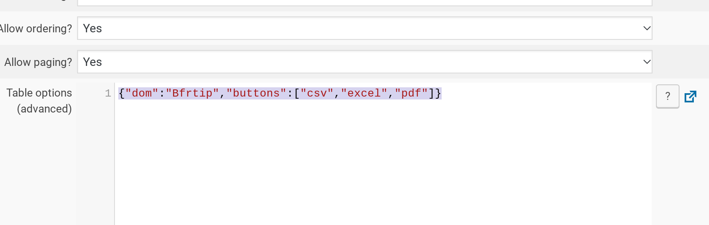

# wp-data-access-buttons

This is a WordPress plugin designed to work with Peter Shulz's [WP Data 
Access](https://wordpress.org/plugins/wp-data-access/) plugin. This plugin adds 
the [Buttons](https://datatables.net/extensions/buttons/) extension from 
[dataTables](https://datatables.net/). 

To use, install the plugin in your WordPress and activate. Go to Data Publisher 
in WP Data Access. Create a publication. In the "table options" section, add 
your configuration options for the buttons like so:

For more information, have a look [at this thread from the WP Data Access 
forum](https://wordpress.org/support/topic/adding-datatables-extensions/#post-12788735). 

Pull requests and suggestions welcome!
